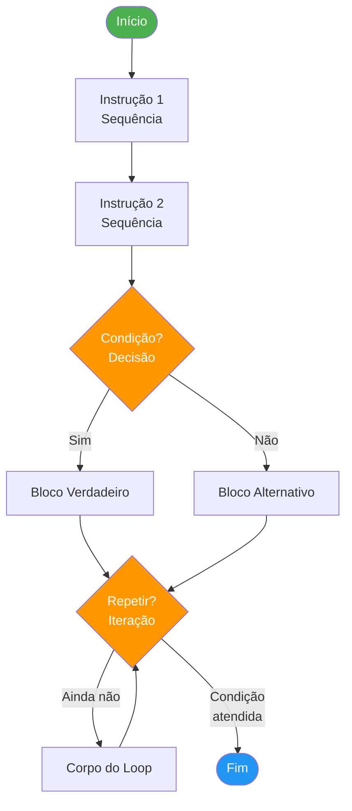

# 02 — Lógica, Algoritmos e Estruturas de Controle de Fluxo

← [Módulo 01](01-fundamentos-pensamento-computacional.md) | **Módulo 02** | [Módulo 03 →](03-hardware-arquitetura.md)

> 📎 **Materiais relacionados:** [Slides](../slides/02-logica-algoritmos.md) · [Checkpoint 01](../praticas/checkpoints/checkpoint-01.md)

---

## Objetivos de aprendizagem

Ao final deste módulo o estudante será capaz de:

- Explicar os três blocos fundamentais de controle de fluxo (sequência, decisão e repetição).
- Representar soluções em pseudocódigo estruturado e fluxogramas padronizados.
- Aplicar técnicas de teste de mesa (trace table) para validar algoritmos.
- Construir algoritmos compostos com aninhamento de estruturas.
- Utilizar operadores lógicos e tabelas-verdade para avaliar expressões compostas.

---

## 1. Lógica de Programação — Fundamento Teórico

Lógica de programação é a aplicação de **lógica formal** à construção de algoritmos. A base teórica vem da lógica proposicional (Boole, 1854) e do cálculo de predicados (Frege, 1879), mas no dia a dia do desenvolvedor, manifesta-se como a capacidade de estruturar decisões de forma correta, completa e verificável.

### 1.1 Teorema da Programação Estruturada

Dijkstra (1968), em seu célebre artigo *"Go To Statement Considered Harmful"*, argumentou contra o uso indiscriminado de desvios incondicionais. A base formal veio de Böhm e Jacopini (1966), que demonstraram matematicamente que **qualquer programa pode ser escrito com apenas três estruturas de controle:**

1. **Sequência** — instruções executadas em ordem.
2. **Seleção** — escolha condicional entre caminhos.
3. **Iteração** — repetição controlada de um bloco.

Isso significa que qualquer fluxo, por mais complexo que pareça, pode ser expresso com essas três construções. Não precisa de `goto`. Não precisa de gambiarra. Precisa de disciplina mental.

### 1.2 Lógica Proposicional Aplicada

Uma **proposição** é uma sentença declarativa que pode ser verdadeira (V) ou falsa (F), sem meio termo. Exemplos:

- "A nota é maior que 7" → proposição (pode ser V ou F).
- "Que horas são?" → **não** é proposição (é pergunta).
- "Estude mais!" → **não** é proposição (é comando).

**Operadores lógicos fundamentais:**

| Operador | Símbolo formal | Significado | Uso em algoritmo |
|----------|---------------|-----------|-----------------|
| Conjunção | ∧ | Ambas verdadeiras | `E` / `AND` |
| Disjunção | ∨ | Pelo menos uma verdadeira | `OU` / `OR` |
| Negação | ¬ | Inverte o valor | `NÃO` / `NOT` |

**Tabela-verdade completa:**

| P | Q | P ∧ Q | P ∨ Q | ¬P | P → Q (implicação) |
|---|---|-------|-------|----|---------------------|
| V | V | V | V | F | V |
| V | F | F | V | F | F |
| F | V | F | V | V | V |
| F | F | F | F | V | V |

A implicação (P → Q, "se P então Q") é especialmente importante: é falsa **apenas** quando P é verdadeiro e Q é falso. Isso formaliza a estrutura `Se...Então` presente em todo algoritmo.

**Leis de De Morgan (essenciais para simplificar condições):**

- ¬(P ∧ Q) ≡ ¬P ∨ ¬Q
- ¬(P ∨ Q) ≡ ¬P ∧ ¬Q

Exemplo prático: "NÃO (é aluno E está matriculado)" equivale a "NÃO é aluno OU NÃO está matriculado". Saber aplicar De Morgan evita condições confusas e bugs lógicos sutis.

---

## 2. Estruturas de Controle de Fluxo



### 2.1 Sequência

Instruções executadas na ordem em que aparecem, uma após a outra, sem desvios.

```
1. Ler valor_hora
2. Ler horas_trabalhadas
3. salario_bruto ← valor_hora × horas_trabalhadas
4. imposto ← salario_bruto × 0.11
5. salario_liquido ← salario_bruto - imposto
6. Exibir salario_liquido
```

**Propriedade fundamental:** a ordem importa. Inverter os passos 1 e 3 tornaria o algoritmo inválido porque `valor_hora` ainda não existiria. Essa dependência entre passos é chamada de **dependência de dados**.

### 2.2 Decisão (Seleção)

Permite escolher caminhos diferentes com base em condições lógicas. Três formas canônicas:

**Decisão simples (Se-Então):**

```
Se temperatura > 38.0 então
  Exibir "Febre detectada — encaminhar para triagem"
FimSe
```

**Decisão composta (Se-Então-Senão):**

```
Se idade >= 18 então
  Exibir "Maior de idade — apto a votar"
Senão
  Exibir "Menor de idade — voto facultativo até 16"
FimSe
```

**Decisão encadeada (múltiplas condições mutuamente exclusivas):**

```
Se nota >= 9.0 então
  conceito ← "A — Excelente"
Senão Se nota >= 7.0 então
  conceito ← "B — Bom"
Senão Se nota >= 5.0 então
  conceito ← "C — Regular"
Senão Se nota >= 3.0 então
  conceito ← "D — Insuficiente"
Senão
  conceito ← "E — Reprovado"
FimSe
```

**Decisão com condição composta:**

```
Se idade >= 18 E possui_CNH = verdadeiro então
  Exibir "Apto a dirigir"
Senão
  Exibir "Não apto"
FimSe
```

**Armadilha clássica:** confundir `E` com `OU`. "Entrada permitida se é professor OU é coordenador" é diferente de "Entrada permitida se é professor E é coordenador". O primeiro aceita qualquer um dos dois; o segundo exige os dois simultaneamente.

### 2.3 Repetição (Iteração)

Permite executar um bloco de instruções múltiplas vezes de forma controlada.

**Enquanto (while) — teste no início:**

A condição é avaliada **antes** de cada execução. Se for falsa logo no início, o bloco nunca executa.

```
contador ← 1
Enquanto contador <= 10 faça
  Exibir contador
  contador ← contador + 1
FimEnquanto
```

**Para (for) — contador controlado:**

Ideal quando o número de iterações é conhecido previamente.

```
Para i de 1 até 10 faça
  Exibir i × 3
FimPara
```

**Repita-Até (do-while) — teste no final:**

O bloco executa **pelo menos uma vez** antes de verificar a condição de saída.

```
Repita
  Exibir "Digite a senha:"
  Ler senha_digitada
Até senha_digitada = senha_correta
```

**Quadro comparativo — quando usar cada uma:**

| Estrutura | Número de execuções | Teste | Use quando... |
|-----------|-------------------|-------|--------------|
| Enquanto | 0 a N | Antes | Não sabe quantas vezes; pode não executar |
| Para | Exatamente N | Antes/controlado | Sabe o total de iterações |
| Repita-Até | 1 a N | Depois | Precisa executar pelo menos uma vez |

**Perigo: loop infinito.** Se a condição de parada nunca se torna falsa, o programa executa para sempre. Exemplo:

```
// BUG: contador nunca é incrementado
contador ← 1
Enquanto contador <= 10 faça
  Exibir contador
  // faltou: contador ← contador + 1
FimEnquanto
```

Dijkstra (1972) afirmava que a terminação de loops é uma das propriedades mais difíceis de garantir formalmente. Na prática, sempre verifique: *"a cada iteração, estou me aproximando da condição de saída?"*

---

## 3. Pseudocódigo Estruturado

O pseudocódigo é uma notação semiformal que descreve algoritmos em linguagem próxima do português, mas com estrutura suficiente para ser convertida em qualquer linguagem de programação.

**Convenções adotadas nesta disciplina:**

- Palavras reservadas em destaque: `Se`, `Então`, `Senão`, `Enquanto`, `Para`, `FimSe`, `FimEnquanto`, `FimPara`.
- Atribuição com seta: `variavel ← valor`.
- Comparação com operadores: `=`, `≠`, `>`, `<`, `>=`, `<=`.
- Indentação obrigatória para blocos internos (2 ou 4 espaços, consistente).
- Comentários com `//`.

### Exemplo Evolutivo Completo — Sistema de Notas

**Versão 1 — Nota simples (uma decisão):**

```
Início
  Ler nota
  Se nota >= 7.0 então
    Exibir "Aprovado"
  Senão
    Exibir "Reprovado"
  FimSe
Fim
```

**Versão 2 — Nota com frequência e conceito (decisão encadeada + condição composta):**

```
Início
  Ler nota
  Ler frequencia  // percentual de presença (0 a 100)

  Se frequencia < 75 então
    situacao ← "Reprovado por falta"
  Senão Se nota >= 7.0 então
    situacao ← "Aprovado"
  Senão Se nota >= 5.0 então
    situacao ← "Recuperação"
  Senão
    situacao ← "Reprovado por nota"
  FimSe

  Exibir situacao
Fim
```

**Versão 3 — Turma inteira com estatísticas (repetição + acumuladores):**

```
Início
  total_alunos ← 30
  soma_notas ← 0
  aprovados ← 0
  maior_nota ← 0
  menor_nota ← 10

  Para i de 1 até total_alunos faça
    Exibir "Nota do aluno", i, ":"
    Ler nota

    soma_notas ← soma_notas + nota

    Se nota >= 7.0 então
      aprovados ← aprovados + 1
    FimSe

    Se nota > maior_nota então
      maior_nota ← nota
    FimSe

    Se nota < menor_nota então
      menor_nota ← nota
    FimSe
  FimPara

  media_turma ← soma_notas / total_alunos
  taxa_aprovacao ← (aprovados / total_alunos) × 100

  Exibir "Média da turma:", media_turma
  Exibir "Maior nota:", maior_nota
  Exibir "Menor nota:", menor_nota
  Exibir "Taxa de aprovação:", taxa_aprovacao, "%"
Fim
```

**Versão 4 — Com validação de entrada (repetição + robustez):**

```
Início
  total_alunos ← 30
  soma_notas ← 0

  Para i de 1 até total_alunos faça
    Repita
      Exibir "Nota do aluno", i, "(0 a 10):"
      Ler nota
      Se nota < 0 OU nota > 10 então
        Exibir "Nota inválida. Tente novamente."
      FimSe
    Até nota >= 0 E nota <= 10

    soma_notas ← soma_notas + nota
  FimPara

  Exibir "Média:", soma_notas / total_alunos
Fim
```

Observe a **progressão**: mesmo domínio de problema, complexidade crescente a cada versão. Cada versão adiciona uma camada de realismo sem invalidar o aprendizado anterior. Isso é design instrucional por **scaffolding** (Vygotsky, 1978).

---

## 4. Fluxogramas — Representação Visual

Fluxogramas seguem a norma **ISO 5807:1985** e usam símbolos padronizados:

| Símbolo | Forma | Uso |
|---------|-------|-----|
| Terminal | Retângulo arredondado | Início / Fim do algoritmo |
| Processo | Retângulo | Ação, cálculo ou atribuição |
| Decisão | Losango | Condição com saídas Sim/Não |
| Entrada/Saída | Paralelogramo | Leitura ou exibição de dados |
| Fluxo | Seta | Direção da execução |
| Conector | Círculo pequeno | Liga partes do fluxo em páginas diferentes |

**Regras práticas de qualidade:**

1. Fluxo principal de cima para baixo, da esquerda para a direita.
2. Cada losango de decisão tem exatamente duas saídas rotuladas (Sim/Não).
3. Se o fluxograma não cabe em uma página, o algoritmo precisa ser decomposto.
4. Evite cruzamento de linhas — redesenhe antes de aceitar espaguete visual.

### Exemplo: Fluxograma do Caixa Eletrônico

```
[Início]
   ↓
[Inserir cartão]
   ↓
tentativas ← 0
   ↓
[Ler senha] ←──────────────────────┐
   ↓                                │
◇ Senha correta?                    │
  │Sim                              │
  ↓                                 │
[Exibir menu]                       │
  ↓                                 │
◇ Opção = Saque?                    │
  │Sim                              │
  ↓                                 │
[Ler valor]                         │
  ↓                                 │
◇ Saldo >= valor?                   │
  │Sim → [Debitar] → [Entregar] → [Fim]
  │Não → [Exibir "Saldo insuficiente"] → [Exibir menu]
  │                                 │
  │Não (senha)                      │
  ↓                                 │
tentativas ← tentativas + 1         │
  ↓                                 │
◇ tentativas >= 3?                  │
  │Sim → [Bloquear cartão] → [Fim] │
  │Não → [Exibir "Senha incorreta"]┘
```

---

## 5. Teste de Mesa (Trace Table)

O teste de mesa é a técnica de **execução manual** de um algoritmo, registrando o valor de cada variável a cada passo. É o equivalente a um depurador (debugger) executado no papel — e frequentemente **mais eficaz** para encontrar erros lógicos (Zeller, 2009).

### Exemplo 1: Soma dos números de 1 a 5

```
soma ← 0
Para i de 1 até 5 faça
  soma ← soma + i
FimPara
Exibir soma
```

| Passo | i | soma | Condição i <= 5 |
|-------|---|------|-----------------|
| Início | — | 0 | — |
| Iteração 1 | 1 | 0 + 1 = 1 | V |
| Iteração 2 | 2 | 1 + 2 = 3 | V |
| Iteração 3 | 3 | 3 + 3 = 6 | V |
| Iteração 4 | 4 | 6 + 4 = 10 | V |
| Iteração 5 | 5 | 10 + 5 = 15 | V |
| Saída | 6 | 15 | F → encerra |

**Resultado: 15** ✓ (conferência: soma de PA = n(n+1)/2 = 5×6/2 = 15)

### Exemplo 2: Encontrar o erro

```
// Objetivo: exibir números pares de 2 a 10
n ← 2
Enquanto n < 10 faça
  Exibir n
  n ← n + 2
FimEnquanto
```

| Passo | n | Condição n < 10 | Exibe |
|-------|---|-----------------|-------|
| Início | 2 | V | 2 |
| 2 | 4 | V | 4 |
| 3 | 6 | V | 6 |
| 4 | 8 | V | 8 |
| 5 | 10 | F → sai | — |

**Bug:** o número 10 não é exibido porque a condição é `< 10` e não `<= 10`. A correção é alterar para `n <= 10`. O teste de mesa expôs um **erro off-by-one**, o bug mais comum em programação (Fenton & Bieman, 2014).

---

## 6. Estratégia de Testes para Algoritmos

Antes de declarar que um algoritmo "funciona", teste com pelo menos três categorias de entrada:

| Categoria | Descrição | Exemplo (sistema de notas) |
|-----------|-----------|---------------------------|
| **Normal** | Entrada típica esperada | nota = 8.5, frequência = 90% |
| **Limite (boundary)** | Valor exato na fronteira da condição | nota = 7.0 e nota = 6.99; frequência = 75% e 74% |
| **Inválido** | Entrada fora do domínio | nota = -3, nota = 15, frequência = 120% |

Essa abordagem é derivada da técnica de **Análise de Valor Limite (Boundary Value Analysis)** formalizada por Myers, Sandler e Badgett (2011). Na indústria, é uma das técnicas obrigatórias em testes de software.

**Princípio adicional — Partição de Equivalência:**

Divida o domínio de entrada em classes onde todos os valores devem produzir o mesmo comportamento. Teste pelo menos um valor de cada classe:

- Classe 1: nota < 0 (inválido) → representante: -1
- Classe 2: 0 <= nota < 5 (reprovado) → representante: 3.0
- Classe 3: 5 <= nota < 7 (recuperação) → representante: 6.0
- Classe 4: nota >= 7 (aprovado) → representante: 8.5
- Classe 5: nota > 10 (inválido) → representante: 12.0

---

## 7. Atividade Prática — Progressão em 3 Níveis

### Nível 1 — Sequência e decisão (10 min)

Escreva algoritmo que lê o salário de um funcionário e calcula o reajuste:

- Salário até R$ 1.500: reajuste de 15%.
- Salário de R$ 1.501 a R$ 3.000: reajuste de 10%.
- Salário acima de R$ 3.000: reajuste de 5%.
Exiba o novo salário. Faça teste de mesa com valores de cada faixa + fronteiras (R$ 1.500 e R$ 3.000).

### Nível 2 — Repetição com acumuladores (15 min)

Escreva algoritmo que lê as notas de 40 alunos e, ao final, exibe:

- Maior nota e menor nota.
- Média da turma.
- Quantidade de alunos em cada faixa de conceito (A, B, C, D, E).
- Desvio em relação à média para o aluno com maior e menor nota.
Faça teste de mesa com 5 alunos fictícios.

### Nível 3 — Composição completa (20 min)

Modele o sistema de um caixa eletrônico com:

- Autenticação por senha (máximo 3 tentativas; bloqueia após falha).
- Menu: consultar saldo, sacar, depositar, sair.
- Saque limitado a R$ 1.000 por operação e R$ 3.000 por dia.
- Depósito registra valor e atualiza saldo.
- Registro de todas as operações com tipo, valor e saldo resultante.
Entregue: pseudocódigo + fluxograma + teste de mesa para os cenários de bloqueio por senha e estouro de limite diário.

---

## 8. Síntese

Programar não é decorar sintaxe. É **controlar fluxo de decisões com clareza e disciplina**. Dijkstra (1972) defendia que pensar antes de escrever é mais barato em toda métrica possível — tempo, dinheiro e sanidade mental. Os três blocos estruturais (sequência, decisão, repetição) são suficientes para expressar qualquer computação. O investimento em lógica sólida nesta fase paga dividendos compostos em todas as disciplinas que virão.

---

## Referências

- BÖHM, Corrado; JACOPINI, Giuseppe. Flow diagrams, Turing machines and languages with only two formation rules. *Communications of the ACM*, v. 9, n. 5, p. 366-371, 1966. Disponível em: <https://doi.org/10.1145/355592.365646>
- BOOLE, George. *An Investigation of the Laws of Thought*. Walton and Maberly, 1854. Disponível em: <https://www.gutenberg.org/ebooks/15114>
- DIJKSTRA, Edsger W. Go to statement considered harmful. *Communications of the ACM*, v. 11, n. 3, p. 147-148, 1968. Disponível em: <https://doi.org/10.1145/362929.362947>
- DIJKSTRA, Edsger W. Notes on structured programming. In: *Structured Programming*. Academic Press, 1972.
- FENTON, Norman E.; BIEMAN, James M. *Software Metrics: A Rigorous and Practical Approach*. 3. ed. CRC Press, 2014.
- FORBELLONE, André L. V.; EBERSPÄCHER, Henri F. *Lógica de Programação: A Construção de Algoritmos e Estruturas de Dados*. 3. ed. Pearson, 2005.
- ISO 5807:1985 — Information processing — Documentation symbols and conventions for data, program and system flowcharts.
- MYERS, Glenford J.; SANDLER, Corey; BADGETT, Tom. *The Art of Software Testing*. 3. ed. Wiley, 2011.
- VYGOTSKY, Lev S. *Mind in Society: The Development of Higher Psychological Processes*. Harvard University Press, 1978.
- ZELLER, Andreas. *Why Programs Fail: A Guide to Systematic Debugging*. 2. ed. Morgan Kaufmann, 2009.

---

← [Módulo 01](01-fundamentos-pensamento-computacional.md) | **Módulo 02** | [Módulo 03 →](03-hardware-arquitetura.md)
