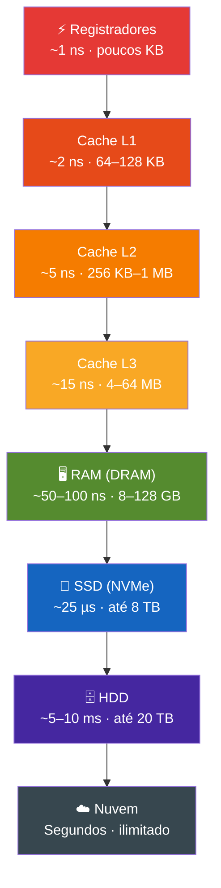

# 03 — Hardware e Arquitetura de Computadores

← [Módulo 02](02-logica-algoritmos-fluxo.md) | **Módulo 03** | [Módulo 04 →](04-dados-numeracao.md)

> 📎 **Materiais relacionados:** [Slides](../slides/03-hardware-arquitetura.md) · [Checkpoint 02](../praticas/checkpoints/checkpoint-02.md)

---

## Objetivos de aprendizagem

Ao final deste módulo o estudante será capaz de:

- Descrever a arquitetura de Von Neumann e o ciclo de instrução.
- Identificar os componentes físicos de um computador e suas funções.
- Explicar a hierarquia de memória e seu impacto no desempenho.
- Analisar gargalos de desempenho com base em métricas reais.
- Comparar arquiteturas CISC e RISC em contexto histórico e contemporâneo.

---

## 1. Breve História da Arquitetura de Computadores

A evolução do hardware computacional é dividida classicamente em **cinco gerações** (Stallings, 2021):

| Geração | Período | Tecnologia | Exemplo |
|---------|---------|-----------|---------|
| 1ª | 1940-1956 | Válvulas termiônicas | ENIAC (1945) — 18.000 válvulas, 30 toneladas |
| 2ª | 1956-1963 | Transistores | IBM 7094 — 10x menor, 10x mais rápido |
| 3ª | 1964-1971 | Circuitos integrados (CI) | IBM System/360 — compatibilidade entre modelos |
| 4ª | 1971-presente | Microprocessadores (VLSI) | Intel 4004 (1971) → Apple M-series (2020+) |
| 5ª | Em desenvolvimento | Computação quântica, neuromórfica | IBM Quantum, Intel Loihi |

A **Lei de Moore** (1965) observou que o número de transistores em um chip dobra aproximadamente a cada 2 anos. Embora limites físicos estejam sendo alcançados — transistores em escala de 3 nm se aproximam de dimensões atômicas —, a indústria contorna isso com paralelismo (múltiplos núcleos), especialização (GPUs, TPUs) e novas arquiteturas (chiplets, 3D stacking).

---

## 2. Arquitetura de Von Neumann

### 2.1 Conceito Fundamental

John von Neumann formalizou em 1945, no *"First Draft of a Report on the EDVAC"*, o modelo que domina a computação até hoje. O princípio central é o **programa armazenado:** instruções e dados compartilham a mesma memória e são acessados pelo mesmo barramento.

### 2.2 Componentes do Modelo

```
┌─────────────────────────────────────────────────┐
│                    CPU                           │
│  ┌─────────────┐  ┌──────────────────────────┐  │
│  │   Unidade   │  │   Unidade Lógica e       │  │
│  │ de Controle │  │   Aritmética (ULA)       │  │
│  │    (UC)     │  │                          │  │
│  └──────┬──────┘  └────────────┬─────────────┘  │
│         │     Registradores    │                 │
│         │    ┌─────────────┐   │                 │
│         └────┤ PC, IR, ACC ├───┘                 │
│              └──────┬──────┘                     │
└─────────────────────┼───────────────────────────┘
                      │ Barramento do Sistema
          ┌───────────┼───────────┐
          │           │           │
   ┌──────┴──────┐    │    ┌──────┴──────┐
   │  Memória    │    │    │ Dispositivos │
   │  Principal  │    │    │    de E/S    │
   │   (RAM)     │    │    │             │
   └─────────────┘    │    └─────────────┘
                      │
               ┌──────┴──────┐
               │Armazenamento│
               │ Secundário  │
               │ (SSD/HDD)   │
               └─────────────┘
```

**Unidade Central de Processamento (CPU):**

| Componente | Função |
|-----------|--------|
| **Unidade de Controle (UC)** | Busca instruções na memória, decodifica e coordena a execução |
| **Unidade Lógica e Aritmética (ULA)** | Executa operações matemáticas e lógicas (soma, comparação, AND, OR) |
| **Registradores** | Memória ultra-rápida dentro da CPU; armazenam dados temporários da operação em curso |

**Registradores essenciais:**

| Registrador | Sigla | Função |
|------------|-------|--------|
| Program Counter | PC | Endereço da próxima instrução a ser executada |
| Instruction Register | IR | Instrução atualmente em execução |
| Accumulator | ACC | Resultado temporário de operações da ULA |
| Memory Address Register | MAR | Endereço de memória sendo acessado |
| Memory Data Register | MDR | Dado sendo lido/escrito na memória |

### 2.3 Ciclo de Instrução (Fetch-Decode-Execute)

Toda instrução passa por um ciclo de três fases (Patterson & Hennessy, 2020):

1. **Busca (Fetch):** a UC lê a instrução no endereço apontado pelo PC e carrega no IR. O PC é incrementado.
2. **Decodificação (Decode):** a UC interpreta a instrução e identifica a operação e os operandos.
3. **Execução (Execute):** a ULA (ou outro componente) realiza a operação. O resultado é armazenado em registrador ou memória.

```
Exemplo concreto:
Instrução: ADD R1, R2    (somar conteúdo de R2 ao conteúdo de R1)

Fetch:   PC = 1000 → Memória[1000] carregada no IR → PC = 1001
Decode:  IR contém "ADD R1, R2" → operação = soma, operandos = R1 e R2
Execute: ULA calcula R1 + R2 → resultado armazenado em R1
```

Processadores modernos executam **bilhões** desses ciclos por segundo. Um processador de 4 GHz completa 4 × 10⁹ ciclos/s. A unidade de medida é o **clock** (hertz).

### 2.4 Gargalo de Von Neumann

O modelo tem uma limitação estrutural: instruções e dados competem pelo **mesmo barramento** para acessar a **mesma memória**. Como a velocidade da CPU cresceu muito mais rápido que a velocidade da memória, surge o **Von Neumann Bottleneck** — a CPU frequentemente espera dados chegarem da memória (Backus, 1978).

Soluções modernas para esse gargalo:

| Técnica | Como funciona |
|---------|--------------|
| Cache (L1, L2, L3) | Cópias rápidas de dados frequentes perto da CPU |
| Pipeline | Sobreposição de fases de diferentes instruções |
| Superescalaridade | Múltiplas ULAs executando instruções em paralelo |
| Branch prediction | CPU "aposta" no resultado de um desvio condicional |
| Prefetch | Busca dados antecipadamente baseada em padrões de acesso |

---

## 3. Hierarquia de Memória

A memória de um computador é organizada em uma **pirâmide** onde velocidade e custo são inversamente proporcionais à capacidade (Stallings, 2021):

```
           ┌──────────┐
           │Registrad. │  ← mais rápida, menor, mais cara
           │  (~1 ns)  │
          ┌┴──────────┴┐
          │  Cache L1   │  (~2 ns, 64-128 KB)
         ┌┴────────────┴┐
         │   Cache L2    │  (~5 ns, 256 KB - 1 MB)
        ┌┴──────────────┴┐
        │    Cache L3     │  (~15 ns, 4-64 MB)
       ┌┴────────────────┴┐
       │   RAM (DRAM)      │  (~50-100 ns, 8-128 GB)
      ┌┴──────────────────┴┐
      │   SSD (NVMe)        │  (~25 μs, 256 GB - 8 TB)
     ┌┴────────────────────┴┐
     │   HDD                 │  (~5-10 ms, 1-20 TB)
    ┌┴──────────────────────┴┐
    │  Armazenamento em nuvem │  ← mais lenta, maior, mais barata
    └────────────────────────┘
```



### 3.1 Princípio da Localidade

A eficiência da hierarquia depende de dois princípios (Hennessy & Patterson, 2017):

- **Localidade temporal:** se um dado foi acessado agora, provavelmente será acessado novamente em breve. Exemplo: variável de controle de um loop.
- **Localidade espacial:** se um dado no endereço X foi acessado, dados em endereços próximos (X+1, X+2...) provavelmente serão acessados em breve. Exemplo: percorrer um array sequencialmente.

O cache explora ambos os princípios: mantém cópias de dados recentemente usados (temporal) e carrega blocos contíguos de memória (espacial).

### 3.2 RAM vs. ROM

| Característica | RAM (Random Access Memory) | ROM (Read-Only Memory) |
|---------------|---------------------------|----------------------|
| Volatilidade | Volátil — perde dados sem energia | Não volátil — mantém dados |
| Velocidade | Alta (~50-100 ns) | Moderada |
| Uso típico | Programas e dados em execução | Firmware, BIOS/UEFI |
| Alteração | Leitura e escrita | Somente leitura (ou escrita limitada em EEPROM/Flash) |

### 3.3 Tipos de RAM

| Tipo | Característica | Uso |
|------|---------------|-----|
| SRAM (Static) | Mais rápida, mais cara, não precisa refresh | Cache L1, L2, L3 |
| DRAM (Dynamic) | Mais lenta, mais barata, precisa refresh periódico | Memória principal |
| DDR4 / DDR5 | Evolução de DRAM com maior largura de banda | PCs e servidores atuais |

---

## 4. Componentes de Hardware

### 4.1 Processador (CPU)

**Métricas de desempenho:**

| Métrica | Significado |
|---------|-----------|
| Clock (GHz) | Frequência dos ciclos — mais ciclos/s = mais operações/s |
| Núcleos (cores) | Unidades de processamento independentes — paralelismo real |
| Threads | Linhas de execução simultâneas por núcleo (ex: Hyper-Threading) |
| IPC (Instructions Per Clock) | Instruções completadas por ciclo — eficiência microarquitetural |
| TDP (Thermal Design Power) | Potência térmica — indica consumo e necessidade de refrigeração |

**Desempenho real ≠ clock alto.** Um processador com 3.5 GHz e IPC alto pode superar um de 5 GHz com IPC baixo. Comparar apenas GHz entre arquiteturas diferentes é erro técnico.

### 4.2 CISC vs. RISC

| Aspecto | CISC | RISC |
|---------|------|------|
| Filosofia | Instruções complexas, cada uma faz muito | Instruções simples, cada uma faz pouco |
| Exemplo | x86 (Intel, AMD) | ARM (Apple M-series, smartphones) |
| Vantagem | Código mais compacto | Pipeline mais eficiente, menor consumo |
| Desvantagem | Decodificação complexa | Mais instruções para mesma tarefa |

A tendência moderna é **convergência**: processadores x86 atuais decodificam instruções CISC em micro-operações RISC internamente. E processadores ARM recentes ganham instruções mais complexas. A fronteira se dissolve (Hennessy & Patterson, 2017).

### 4.3 Armazenamento

| Tecnologia | Tipo | Velocidade leitura | Latência | Durabilidade | Custo/GB |
|-----------|------|-------------------|----------|-------------|----------|
| HDD | Magnético/mecânico | ~150 MB/s | ~5-10 ms | Sensível a impacto | Baixo |
| SSD SATA | Flash NAND | ~550 MB/s | ~50 μs | Sem partes móveis | Médio |
| SSD NVMe | Flash NAND (PCIe) | ~3.500-7.000 MB/s | ~25 μs | Sem partes móveis | Médio-alto |

**A diferença importa na prática:** boot do sistema operacional em HDD pode levar 45-90 segundos; em SSD NVMe, 5-10 segundos. Compilação de projetos grandes reduz de minutos para segundos.

### 4.4 Barramento e Interfaces

O barramento é o canal de comunicação entre componentes. Seus parâmetros:

- **Largura** (bits): quantidade de dados transferidos simultaneamente (32 bits, 64 bits).
- **Frequência** (MHz/GHz): velocidade de transferência.
- **Throughput** = Largura × Frequência: vazão total em bytes/segundo.

**Interfaces modernas:**

| Interface | Throughput | Uso principal |
|----------|-----------|--------------|
| PCIe 4.0 (x16) | ~32 GB/s | GPU, SSD NVMe |
| PCIe 5.0 (x16) | ~64 GB/s | GPU de última geração |
| USB 3.2 Gen 2 | ~1.25 GB/s | Periféricos de alta velocidade |
| USB4 / Thunderbolt 4 | ~5 GB/s | Docking stations, displays, storage |
| SATA III | ~600 MB/s | SSDs SATA, HDDs |

### 4.5 GPU (Graphics Processing Unit)

Originalmente projetada para renderização gráfica, a GPU se tornou peça central em computação paralela. Diferença arquitetural:

| Aspecto | CPU | GPU |
|---------|-----|-----|
| Núcleos | Poucos (4-64), poderosos | Milhares (1.000-16.000), simples |
| Otimizada para | Tarefas sequenciais complexas | Operações paralelas sobre grandes conjuntos de dados |
| Uso moderno | SO, aplicações, lógica | Renderização, IA/ML, computação científica |

O paradigma **GPGPU (General-Purpose computing on GPU)** abriu caminho para o treinamento de redes neurais profundas (deep learning), que depende de milhões de multiplicações matriciais em paralelo.

---

## 5. Gargalos de Desempenho — Diagnóstico Real

Um computador é tão rápido quanto seu componente mais lento no caminho crítico. Gargalos comuns:

| Sintoma | Gargalo provável | Diagnóstico |
|---------|-----------------|-------------|
| Sistema lento para abrir apps | Armazenamento | Alto tempo de leitura no monitor de recursos |
| Travamentos em multitarefa | RAM insuficiente | Uso de swap/página alto; RAM próxima de 100% |
| Lentidão em renderização/compilação | CPU saturada | Uso de CPU sustentado em 100% |
| Fps baixo em jogos/aplicações 3D | GPU insuficiente | Uso de GPU em 100% enquanto CPU está ociosa |
| Downloads lentos | Rede | Largura de banda ou latência da conexão |

### 5.1 A Falácia do "Processador Forte"

Um computador com i9 de última geração e 8 GB de RAM DDR4 com HDD mecânico será **substancialmente mais lento** no uso diário do que um com i5 médio, 16 GB DDR5 e SSD NVMe. O processador forte fica ocioso esperando dados do disco. O HDD é o equivalente a ter um carro de Fórmula 1 numa estrada de terra.

---

## 6. Experimento Prático — Monitoramento de Recursos

### Nível 1 — Observação (10 min)

Abra o monitor de recursos do sistema (Task Manager no Windows; `htop` ou `btop` no Linux; Activity Monitor no macOS) e registre:

| Cenário | CPU (%) | RAM (MB) | Disco (%) |
|---------|---------|----------|-----------|
| Repouso (nada aberto) | | | |
| Navegador com 3 abas | | | |
| Navegador com 30 abas | | | |
| Editor + navegador + terminal | | | |

### Nível 2 — Análise (15 min)

Responda:

1. Qual recurso foi mais impactado ao aumentar abas?
2. A RAM disponível caiu linearmente com o número de abas?
3. Houve uso de swap/memória virtual? Em que momento?

### Nível 3 — Investigação (20 min)

Pesquise e explique:

1. Quantos transistores tem o processador da sua máquina? Compare com o Intel 4004 (2.300 transistores em 1971).
2. Qual o tamanho e a organização da cache (L1/L2/L3) do seu processador?
3. Se seu computador usa HDD, quanto tempo economizaria trocando por SSD NVMe no boot?

---

## 7. Síntese

A arquitetura de Von Neumann, com mais de 75 anos, permanece como modelo dominante — mas profundamente otimizada. Entender seus componentes, limitações e métricas reais é essencial para qualquer profissional de ADS: desde escolher infraestrutura para um sistema até diagnosticar problemas de desempenho em produção. O hardware não é caixa preta mágica — é o alicerce onde todo software existe.

---

## Referências

- BACKUS, John. Can programming be liberated from the von Neumann style? *Communications of the ACM*, v. 21, n. 8, p. 613-641, 1978. Disponível em: <https://doi.org/10.1145/359576.359579>
- HENNESSY, John L.; PATTERSON, David A. *Computer Architecture: A Quantitative Approach*. 6. ed. Morgan Kaufmann, 2017.
- MOORE, Gordon E. Cramming more components onto integrated circuits. *Electronics*, v. 38, n. 8, p. 114-117, 1965.
- PATTERSON, David A.; HENNESSY, John L. *Computer Organization and Design: The Hardware/Software Interface* (RISC-V Edition). 2. ed. Morgan Kaufmann, 2020.
- STALLINGS, William. *Computer Organization and Architecture: Designing for Performance*. 11. ed. Pearson, 2021.
- TANENBAUM, Andrew S.; AUSTIN, Todd. *Structured Computer Organization*. 6. ed. Pearson, 2012.
- VON NEUMANN, John. *First Draft of a Report on the EDVAC*. University of Pennsylvania, 1945. Disponível em: <https://web.mit.edu/STS.035/www/PDFs/edvac.pdf>
- MONTEIRO, Mario A. *Introdução à Organização de Computadores*. 5. ed. LTC, 2007.

---

← [Módulo 02](02-logica-algoritmos-fluxo.md) | **Módulo 03** | [Módulo 04 →](04-dados-numeracao.md)
