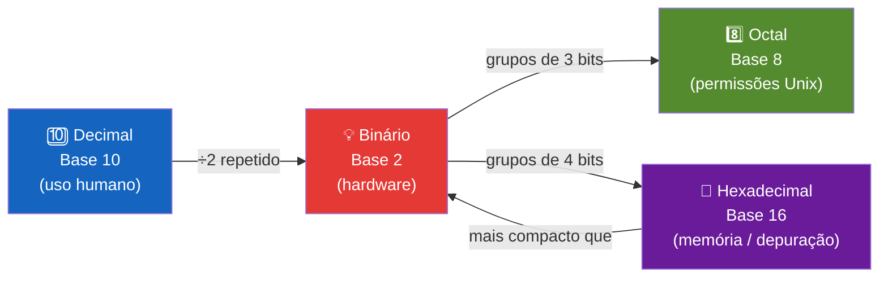

# 04 — Representação de Dados e Sistemas de Numeração

← [Módulo 03](03-hardware-arquitetura.md) | **Módulo 04** | [Módulo 05 →](05-sistemas-operacionais.md)

> 📎 **Materiais relacionados:** [Slides](../slides/04-dados-numeracao.md) · [Checkpoint 02](../praticas/checkpoints/checkpoint-02.md)

---

## Objetivos de aprendizagem

Ao final deste módulo o estudante será capaz de:

- Explicar por que computadores utilizam o sistema binário.
- Realizar conversões entre decimal, binário, octal e hexadecimal.
- Executar operações aritméticas em binário (soma, subtração via complemento a dois).
- Compreender a representação de inteiros com sinal (complemento a dois) e ponto flutuante (IEEE 754).
- Descrever como texto (ASCII, Unicode/UTF-8), imagens e áudio são codificados digitalmente.

---

## 1. Por Que Binário?

Computadores utilizam o sistema binário (base 2) por uma razão física: circuitos eletrônicos operam de forma mais confiável com **dois estados discretos** — tensão alta (1) e tensão baixa (0). Shannon (1948) demonstrou em sua teoria da informação que qualquer mensagem pode ser codificada como sequência de bits (binary digits), tornando o binário o sistema natural para processamento digital.

**Bit** é a menor unidade de informação: 0 ou 1.
**Byte** = 8 bits = 2⁸ = 256 valores possíveis (de 0 a 255 ou de -128 a 127 com sinal).

| Unidade | Equivalência | Contexto |
|---------|-------------|---------|
| 1 bit | 0 ou 1 | Um sim/não, verdadeiro/falso |
| 1 byte | 8 bits | Um caractere ASCII |
| 1 KB (kilobyte) | 1.024 bytes | ~1 página de texto |
| 1 MB (megabyte) | 1.024 KB | ~1 foto em alta resolução |
| 1 GB (gigabyte) | 1.024 MB | ~250 músicas MP3 |
| 1 TB (terabyte) | 1.024 GB | ~500 horas de vídeo HD |

**Observação técnica:** O padrão IEC distingue prefixos binários (KiB = 1.024 bytes) de prefixos decimais (kB = 1.000 bytes). Na prática cotidiana, a confusão persiste, mas sistemas operacionais frequentemente usam potências de 2.

---

## 2. Sistemas de Numeração

### 2.1 Sistema Posicional

Em qualquer base B, o valor de um número é determinado pela **posição** de cada dígito:

$$N = d_{n} \times B^{n} + d_{n-1} \times B^{n-1} + \ldots + d_{1} \times B^{1} + d_{0} \times B^{0}$$

Exemplo: 345 em base 10 = 3×10² + 4×10¹ + 5×10⁰ = 300 + 40 + 5 = 345.

### 2.2 Bases Utilizadas em Computação

| Base | Nome | Dígitos | Uso principal |
|------|------|---------|--------------|
| 2 | Binário | 0, 1 | Nível de hardware, operações lógicas |
| 8 | Octal | 0-7 | Permissões Unix (chmod 755), legado |
| 10 | Decimal | 0-9 | Uso humano cotidiano |
| 16 | Hexadecimal | 0-9, A-F | Endereços de memória, cores CSS (#FF5733), depuração |



**Correspondência binário ↔ hexadecimal (agrupamento de 4 bits):**

| Hex | Bin | Hex | Bin |
|-----|-----|-----|-----|
| 0 | 0000 | 8 | 1000 |
| 1 | 0001 | 9 | 1001 |
| 2 | 0010 | A | 1010 |
| 3 | 0011 | B | 1011 |
| 4 | 0100 | C | 1100 |
| 5 | 0101 | D | 1101 |
| 6 | 0110 | E | 1110 |
| 7 | 0111 | F | 1111 |

Essa correspondência direta torna o hexadecimal uma forma **compacta** de representar binário: cada dígito hex equivale a exatamente 4 bits. Por isso endereços de memória são expressos em hex (ex: `0x7FFE3A20`).

---

## 3. Conversões entre Bases

### 3.1 Decimal → Binário (divisões sucessivas)

Regra: divida o número por 2 repetidamente e anote os **restos de baixo para cima**.

**Exemplo: 45₁₀ → binário**

| Divisão | Quociente | Resto |
|---------|-----------|-------|
| 45 ÷ 2 | 22 | 1 |
| 22 ÷ 2 | 11 | 0 |
| 11 ÷ 2 | 5 | 1 |
| 5 ÷ 2 | 2 | 1 |
| 2 ÷ 2 | 1 | 0 |
| 1 ÷ 2 | 0 | 1 |

Lendo os restos de baixo para cima: **45₁₀ = 101101₂**

**Verificação:** 1×2⁵ + 0×2⁴ + 1×2³ + 1×2² + 0×2¹ + 1×2⁰ = 32 + 0 + 8 + 4 + 0 + 1 = 45 ✓

### 3.2 Binário → Decimal (soma posicional)

Multiplique cada dígito pela potência de 2 correspondente à sua posição.

**Exemplo: 11010110₂ → decimal**

| Posição | 7 | 6 | 5 | 4 | 3 | 2 | 1 | 0 |
|---------|---|---|---|---|---|---|---|---|
| Dígito | 1 | 1 | 0 | 1 | 0 | 1 | 1 | 0 |
| Potência | 128 | 64 | 32 | 16 | 8 | 4 | 2 | 1 |
| Valor | 128 | 64 | 0 | 16 | 0 | 4 | 2 | 0 |

Soma: 128 + 64 + 16 + 4 + 2 = **214₁₀** ✓

### 3.3 Decimal → Hexadecimal

Divida por 16, anote os restos (usando A=10, B=11... F=15).

**Exemplo: 255₁₀ → hexadecimal**

| Divisão | Quociente | Resto |
|---------|-----------|-------|
| 255 ÷ 16 | 15 | 15 → F |
| 15 ÷ 16 | 0 | 15 → F |

Resultado: **255₁₀ = FF₁₆** (ou 0xFF na notação C/Java)

**Exemplo: 1024₁₀ → hexadecimal**

| Divisão | Quociente | Resto |
|---------|-----------|-------|
| 1024 ÷ 16 | 64 | 0 |
| 64 ÷ 16 | 4 | 0 |
| 4 ÷ 16 | 0 | 4 |

Resultado: **1024₁₀ = 400₁₆** (ou 0x400)

### 3.4 Binário → Hexadecimal (atalho)

Agrupe os bits de 4 em 4 da direita para a esquerda e converta cada grupo:

**Exemplo: 101101₂ → hex**

- Agrupamento: 0010 | 1101
- 0010 = 2, 1101 = D
- Resultado: **2D₁₆**

Verificação: 2×16¹ + 13×16⁰ = 32 + 13 = 45 ✓ (que é nosso 101101₂ de antes)

### 3.5 Decimal → Octal

Divida por 8, anote os restos.

**Exemplo: 45₁₀ → octal**

| Divisão | Quociente | Resto |
|---------|-----------|-------|
| 45 ÷ 8 | 5 | 5 |
| 5 ÷ 8 | 0 | 5 |

Resultado: **45₁₀ = 55₈**

Verificação: 5×8¹ + 5×8⁰ = 40 + 5 = 45 ✓

**Uso prático do octal:** permissões de arquivos em Unix/Linux. `chmod 755` significa:

- 7 (111₂) → dono: leitura + escrita + execução
- 5 (101₂) → grupo: leitura + execução
- 5 (101₂) → outros: leitura + execução

---

## 4. Aritmética Binária

### 4.1 Soma Binária

Regras fundamentais:

| Operação | Resultado | Vai-um (carry) |
|----------|-----------|----------------|
| 0 + 0 | 0 | 0 |
| 0 + 1 | 1 | 0 |
| 1 + 0 | 1 | 0 |
| 1 + 1 | 0 | 1 |
| 1 + 1 + 1 | 1 | 1 |

**Exemplo: 1011₂ + 1101₂**

```
  Vai-um:  1 1 1
           1 0 1 1   (11₁₀)
         + 1 1 0 1   (13₁₀)
         ---------
        1 1 0 0 0    (24₁₀)  ✓
```

### 4.2 Representação de Inteiros com Sinal — Complemento a Dois

Como representar números negativos se só temos 0 e 1?

O método padrão é o **complemento a dois** (two's complement), proposto formalmente por von Neumann. Em n bits:

- Faixa de valores: de **-2^(n-1)** a **+2^(n-1) - 1**
- Em 8 bits: de -128 a +127 (256 valores)
- O bit mais significativo (MSB) indica o sinal: 0 = positivo, 1 = negativo

**Como calcular o complemento a dois de um número:**

1. Escreva o valor absoluto em binário.
2. Inverta todos os bits (complemento a um).
3. Some 1.

**Exemplo: representar -45 em 8 bits**

1. +45 = 00101101₂
2. Inversão: 11010010₂
3. +1: 11010010 + 1 = **11010011₂**

**Verificação:** 11010011₂ interpretado como complemento a dois:
-128 + 64 + 16 + 2 + 1 = -128 + 83 = -45 ✓

**Vantagem do complemento a dois:** a soma funciona naturalmente, sem circuito especial para subtração. Para calcular A - B, basta calcular A + (-B).

### 4.3 Overflow

Quando o resultado excede a faixa representável, ocorre **overflow**. Em 8 bits com sinal:

```
  01111111   (+127)
+ 00000001   (+1)
----------
  10000000   (-128!)  ← overflow: resultado errado
```

O resultado deveria ser +128, mas em 8 bits com sinal o máximo é +127. O bit de sinal "virou" indicando negativo. Esse tipo de bug já causou desastres reais — como o foguete Ariane 5 em 1996, que explodiu por overflow na conversão de um valor de 64 bits para 16 bits (Lions, 1996).

---

## 5. Representação de Ponto Flutuante — IEEE 754

Números reais são representados aproximadamente pelo padrão **IEEE 754** (1985, revisado em 2008 e 2019).

### 5.1 Formato Geral

Um número em ponto flutuante é composto por:

$$(-1)^{sinal} \times 1.mantissa \times 2^{expoente - bias}$$

| Formato | Bits totais | Sinal | Expoente | Mantissa | Bias |
|---------|-----------|-------|----------|----------|------|
| Precisão simples (float) | 32 | 1 | 8 | 23 | 127 |
| Precisão dupla (double) | 64 | 1 | 11 | 52 | 1023 |

### 5.2 Por que 0.1 + 0.2 ≠ 0.3?

O número 0.1 em decimal é uma **dízima periódica infinita** em binário:

0.1₁₀ = 0.0001100110011001100110011... (repete infinitamente)

Como a mantissa tem bits finitos (23 ou 52), o valor é **truncado** — gerando um erro de arredondamento. Quando somamos dois valores arredondados, o erro se propaga:

```
0.1 + 0.2 em IEEE 754 double ≈ 0.30000000000000004
```

Isso não é bug de linguagem. É propriedade fundamental da representação binária de ponto flutuante. Goldberg (1991) escreveu o artigo definitivo sobre o tema.

**Implicação prática:** nunca compare dois floats com `==`. Use uma tolerância (epsilon):

```
// Errado
Se resultado = 0.3 então ...

// Correto
Se |resultado - 0.3| < 0.00001 então ...
```

### 5.3 Valores Especiais em IEEE 754

| Representação | Significado |
|--------------|-----------|
| Expoente = 0, Mantissa = 0 | Zero (+0 ou -0) |
| Expoente = todos 1s, Mantissa = 0 | Infinito (+∞ ou -∞) |
| Expoente = todos 1s, Mantissa ≠ 0 | NaN (Not a Number) — resultado de 0/0, √(-1) |

---

## 6. Codificação de Texto

### 6.1 ASCII (1963)

American Standard Code for Information Interchange — 7 bits, 128 caracteres.

| Faixa | Caracteres |
|-------|-----------|
| 0-31 | Caracteres de controle (tab, newline, ESC) |
| 32-47 | Pontuação e espaço |
| 48-57 | Dígitos 0-9 |
| 65-90 | Letras maiúsculas A-Z |
| 97-122 | Letras minúsculas a-z |

**Limitação fatal:** não suporta acentos, caracteres de outros idiomas, emojis. O código 65 é sempre 'A', mas 'ç', 'ñ', 'ü' simplesmente não existem no ASCII original.

### 6.2 Unicode e UTF-8

O **Unicode** (consórcio fundado em 1991) define um espaço de mais de 149.000 caracteres cobrindo praticamente todos os sistemas de escrita humanos, símbolos matemáticos e emojis.

O **UTF-8** (Uniform Transformation Format, 8 bits) é a codificação dominante na web (>98% das páginas, segundo W3Techs). Características:

| Bytes | Faixa Unicode | Cobre |
|-------|-------------|-------|
| 1 byte | U+0000 a U+007F | ASCII original (compatível!) |
| 2 bytes | U+0080 a U+07FF | Latim estendido, grego, cirílico, árabe |
| 3 bytes | U+0800 a U+FFFF | CJK (chinês, japonês, coreano), devanagari |
| 4 bytes | U+10000 a U+10FFFF | Emojis, scripts históricos, símbolos musicais |

**Exemplo prático:**

| Caractere | Unicode | UTF-8 (binário) | UTF-8 (hex) | Bytes |
|-----------|---------|-----------------|-------------|-------|
| A | U+0041 | 01000001 | 41 | 1 |
| ç | U+00E7 | 11000011 10100111 | C3 A7 | 2 |
| 中 | U+4E2D | 11100100 10111000 10101101 | E4 B8 AD | 3 |
| 😀 | U+1F600 | 11110000 10011111 10011000 10000000 | F0 9F 98 80 | 4 |

Por isso um arquivo com texto em português (acentos = 2 bytes cada) é ligeiramente maior que o mesmo texto em inglês puro.

### 6.3 Consequências Práticas

- Sempre defina encoding explicitamente em projetos (`UTF-8`).
- Bugs de encoding ("ç" no lugar de "ç") acontecem quando o arquivo é salvo em um encoding e lido em outro.
- Em bancos de dados, use `utf8mb4` (MySQL) ou `UTF8` (PostgreSQL) para suportar emojis.

---

## 7. Codificação de Imagens e Áudio

### 7.1 Imagens Digitais

Uma imagem é uma **matriz de pixels**. Cada pixel armazena informação de cor.

| Modelo | Componentes | Bits por pixel | Uso |
|--------|------------|---------------|-----|
| Preto e branco | 1 bit | 1 | Documentos simples |
| Escala de cinza | 8 bits | 8 | Imagens médicas |
| RGB | 8 bits × 3 canais | 24 | Fotos, web |
| RGBA | 8 bits × 4 canais | 32 | Design (com transparência) |

**Cálculo de tamanho:** Uma foto 1920×1080 em RGB sem compressão:
1920 × 1080 × 3 bytes = 6.220.800 bytes ≈ **5.93 MB**

**Compressão:** Formatos como JPEG (com perdas) e PNG (sem perdas) reduzem drasticamente o tamanho. JPEG explorando redundância visual.

### 7.2 Áudio Digital

O som é uma onda analógica contínua. Para digitalizá-lo, aplicamos o **Teorema de Nyquist-Shannon:** a taxa de amostragem deve ser pelo menos o dobro da maior frequência presente no sinal.

| Parâmetro | Valor (CD) | Significado |
|-----------|-----------|------------|
| Taxa de amostragem | 44.100 Hz | 44.100 amostras por segundo |
| Profundidade | 16 bits | 65.536 níveis de amplitude |
| Canais | 2 (estéreo) | Dois canais independentes |

**Cálculo de tamanho:** 1 minuto de áudio CD sem compressão:
44.100 × 2 bytes × 2 canais × 60 s = 10.584.000 bytes ≈ **10.09 MB/min**

Formatos como MP3 e AAC usam compressão com perdas perceptuais — removem frequências que o ouvido humano dificilmente percebe (psychoacoustic model).

---

## 8. Atividade Prática — Progressão em 3 Níveis

### Nível 1 — Conversões fundamentais (15 min)

1. Converta para binário e hexadecimal: 19, 37, 58, 100, 255.
2. Converta para decimal: 10101₂, 111000₂, 1000001₂, FF₁₆, 1A3₁₆.
3. Converta 755₈ para binário (dica: cada dígito octal = 3 bits).
4. Verifique cada resultado com o método inverso.

### Nível 2 — Aritmética e representação (20 min)

1. Some em binário: 10110₂ + 01101₂. Verifique convertendo para decimal.
2. Represente -19 em complemento a dois com 8 bits. Verifique somando com +19 (deve dar 0).
3. Explique, com cálculos, por que em 8 bits com sinal o range é -128 a +127 (e não -128 a +128).
4. Pesquise: o que aconteceu com o foguete Ariane 5 em 1996 por causa de overflow?

### Nível 3 — Codificação e análise (20 min)

1. Abra um editor hexadecimal (HxD, xxd ou similar) e compare o conteúdo de um arquivo `.txt` salvo em ASCII vs UTF-8 com acentos. Descreva as diferenças.
2. Calcule o tamanho em bytes de uma imagem 4K (3840×2160) em RGBA sem compressão.
3. Calcule quantos minutos de áudio CD cabem em 1 GB sem compressão.
4. Explique em 8 linhas por que "0.1 + 0.2 ≠ 0.3" e como evitar bugs derivados disso.

---

## 9. Síntese

Tudo em um computador — números, texto, fotos, músicas, vídeos, instruções — é, no fundo, sequência de bits. Entender como essa tradução acontece desmistifica erros "inexplicáveis", dimensiona requisitos de armazenamento e rede, e forma a base para disciplinas futuras como banco de dados, redes e programação. Quem domina representação de dados tem vantagem silenciosa em todo o restante do curso.

---

## Referências

- GOLDBERG, David. What every computer scientist should know about floating-point arithmetic. *ACM Computing Surveys*, v. 23, n. 1, p. 5-48, 1991. Disponível em: <https://doi.org/10.1145/103162.103163>
- IEEE 754-2019 — IEEE Standard for Floating-Point Arithmetic. Disponível em: <https://doi.org/10.1109/IEEESTD.2019.8766229>
- LIONS, Jacques-Louis. *Ariane 5 Flight 501 Failure Report*. ESA/CNES, 1996. Disponível em: <https://esamultimedia.esa.int/docs/esa-x-1819eng.pdf>
- PETZOLD, Charles. *Code: The Hidden Language of Computer Hardware and Software*. 2. ed. Microsoft Press, 2022.
- SHANNON, Claude E. A mathematical theory of communication. *Bell System Technical Journal*, v. 27, p. 379-423, 1948. Disponível em: <https://doi.org/10.1002/j.1538-7305.1948.tb01338.x>
- STALLINGS, William. *Computer Organization and Architecture*. 11. ed. Pearson, 2021.
- TANENBAUM, Andrew S.; AUSTIN, Todd. *Structured Computer Organization*. 6. ed. Pearson, 2012.
- THE UNICODE CONSORTIUM. *The Unicode Standard*. Disponível em: <https://www.unicode.org/versions/latest/>
- TOCCI, Ronald J.; WIDMER, Neal S.; MOSS, Gregory L. *Sistemas Digitais: Princípios e Aplicações*. 12. ed. Pearson, 2018.

---

← [Módulo 03](03-hardware-arquitetura.md) | **Módulo 04** | [Módulo 05 →](05-sistemas-operacionais.md)
