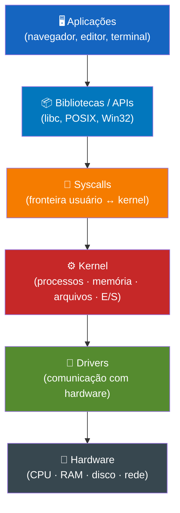

# 05 — Sistemas Operacionais Modernos

← [Módulo 04](04-dados-numeracao.md) | **Módulo 05** | [Módulo 06 →](06-cloud-computing.md)

> 📎 **Materiais relacionados:** [Slides](../slides/05-sistemas-operacionais.md) · [Checkpoint 03](../praticas/checkpoints/checkpoint-03.md)

---

## Objetivos de aprendizagem

Ao final deste módulo o estudante será capaz de:

- Definir sistema operacional e suas camadas de abstração.
- Explicar gerenciamento de processos, threads e escalonamento.
- Descrever gerenciamento de memória (paginação, memória virtual).
- Compreender sistemas de arquivos, permissões e segurança.
- Operar o terminal com comandos essenciais para o profissional de ADS.

---

## 1. O Que é um Sistema Operacional?

Um sistema operacional (SO) é uma camada de software que **gerencia os recursos de hardware** e fornece uma **interface entre usuário/aplicações e o hardware** (Tanenbaum & Bos, 2014). Sem ele, cada programa precisaria saber como comunicar diretamente com cada modelo de disco, placa de rede e teclado — um pesadelo de incompatibilidade.

### 1.1 Funções Fundamentais

| Função | O que faz | Exemplo |
|--------|----------|---------|
| Gerência de processos | Cria, escalona e encerra processos | Alternar entre navegador e editor |
| Gerência de memória | Aloca e protege espaços de memória | Impedir que um app acesse dados de outro |
| Sistema de arquivos | Organiza dados em diretórios e arquivos | FAT32, NTFS, ext4, APFS |
| Gerência de E/S | Controla dispositivos via drivers | Imprimir, acessar USB, usar rede |
| Segurança e proteção | Controle de acesso e isolamento | Permissões de arquivo, autenticação |

### 1.2 Camadas de Abstração

```
┌─────────────────────────────────┐
│       Aplicações do Usuário     │  (navegador, editor, terminal)
├─────────────────────────────────┤
│       Bibliotecas / APIs        │  (chamadas de sistema empacotadas)
├─────────────────────────────────┤
│   Chamadas de Sistema (Syscalls)│  (fronteira usuário ↔ kernel)
├─────────────────────────────────┤
│           Kernel                │  (núcleo do SO)
│  ┌───────────┬────────────────┐ │
│  │Gerência de│ Gerência de    │ │
│  │Processos  │ Memória        │ │
│  ├───────────┼────────────────┤ │
│  │Sistema de │ Gerência       │ │
│  │Arquivos   │ de E/S         │ │
│  └───────────┴────────────────┘ │
├─────────────────────────────────┤
│          Drivers                │  (comunicação com hardware)
├─────────────────────────────────┤
│          Hardware               │  (CPU, RAM, disco, rede)
└─────────────────────────────────┘
```



### 1.3 Tipos de Kernel

| Tipo | Descrição | Exemplo |
|------|----------|---------|
| **Monolítico** | Todo o kernel em um único bloco na memória; rápido, mas falha em um subsistema pode derrubar tudo | Linux |
| **Microkernel** | Apenas serviços mínimos no kernel; subsistemas em espaço de usuário; mais modular, mais overhead de comunicação | MINIX, QNX |
| **Híbrido** | Combina elementos de ambos; kernel monolítico com módulos carregáveis | Windows NT, macOS (XNU) |

Linus Torvalds e Andrew Tanenbaum travaram um famoso debate público em 1992 sobre as vantagens de cada modelo — "the Tanenbaum–Torvalds debate". Tanenbaum defendia microkernels como futuro; Torvalds insistiu na praticidade do monolítico. Três décadas depois, ambas as abordagens coexistem.

---

## 2. Gerenciamento de Processos

### 2.1 Processo vs. Thread

| Conceito | Definição | Recursos |
|----------|----------|---------|
| **Processo** | Instância de um programa em execução | Espaço de memória próprio, PID, registradores |
| **Thread** | Unidade de execução dentro de um processo | Compartilha memória do processo; tem próprio stack e PC |

**Analogia técnica:** um processo é como um apartamento (espaço isolado); threads são moradores que compartilham a cozinha e a sala, mas cada um tem seu quarto (stack).

Um navegador moderno cria **processos separados por aba** (Chrome, Edge) para isolamento: se uma aba trava, as outras continuam funcionando. Dentro de cada aba, múltiplas **threads** gerenciam renderização, JavaScript e rede simultaneamente.

### 2.2 Estados de um Processo

```
            ┌────────────┐
 Criação →  │   Pronto   │ ←──────── Interrupção
            │  (ready)   │          (preempção)
            └─────┬──────┘
                  │ Escalonador seleciona
                  ↓
            ┌────────────┐
            │ Executando  │
            │ (running)   │
            └──┬──────┬───┘
               │      │
    Terminou   │      │ Precisa esperar (E/S, recurso)
               ↓      ↓
        ┌──────────┐  ┌────────────┐
        │Terminado │  │ Bloqueado  │
        │ (exit)   │  │ (waiting)  │
        └──────────┘  └─────┬──────┘
                            │ E/S concluída
                            └──→ Pronto
```

### 2.3 Escalonamento de CPU

O **escalonador (scheduler)** decide qual processo pronto receberá a CPU. Critérios de avaliação (Silberschatz, Galvin & Gagne, 2018):

- **Throughput:** processos completados por unidade de tempo.
- **Tempo de espera:** quanto tempo o processo ficou na fila de prontos.
- **Tempo de resposta:** do envio da requisição até a primeira resposta.
- **Fairness:** distribuição justa de CPU entre processos.

**Algoritmos clássicos de escalonamento:**

| Algoritmo | Funcionamento | Prós | Contras |
|-----------|--------------|------|---------|
| **FCFS** (First Come, First Served) | Fila simples por ordem de chegada | Simples | Efeito comboio — processo longo bloqueia todos |
| **SJF** (Shortest Job First) | Prioriza o menor tempo estimado | Minimiza tempo médio de espera | Precisa estimar tempo; pode causar starvation |
| **Round Robin** | Cada processo recebe um quantum de tempo fixo | Justo, bom para interatividade | Performance depende do tamanho do quantum |
| **Prioridade** | Cada processo tem prioridade numérica | Flexível | Starvation de processos de baixa prioridade |
| **Multinível** | Múltiplas filas com políticas diferentes | Combina vantagens | Complexo de configurar |

**Exemplo prático de Round Robin (quantum = 4 ms):**

| Processo | Chegada | Burst | Execução |
|----------|---------|-------|----------|
| P1 | 0 | 10 | 0-4, 8-12, 14-16 |
| P2 | 1 | 4 | 4-8 |
| P3 | 2 | 6 | 12-14 (incompleto...) |

Sistemas operacionais modernos usam variações sofisticadas. O Linux usa o **CFS (Completely Fair Scheduler)**, que modela a justiça como um balanço: cada processo recebe tempo proporcional ao seu peso, usando uma árvore rubro-negra para eficiência O(log n).

---

## 3. Gerenciamento de Memória

### 3.1 Espaço de Endereçamento

Cada processo "vê" um espaço de memória **virtual** contínuo, mesmo que na memória física seus dados estejam fragmentados. Essa ilusão é criada pela **Memory Management Unit (MMU)**, um componente de hardware da CPU.

### 3.2 Paginação

A memória virtual é dividida em blocos de tamanho fixo chamados **páginas** (tipicamente 4 KB). A memória física é dividida em **frames** do mesmo tamanho. Uma **tabela de páginas** mapeia páginas virtuais → frames físicos.

```
Memória Virtual (Processo A)    Tabela de Páginas     Memória Física
┌──────────┐                    ┌─────┬───────┐      ┌──────────┐
│ Página 0 │ ──────────────────→│  0  │Frame 3│──→   │ Frame 0  │
├──────────┤                    ├─────┼───────┤      ├──────────┤
│ Página 1 │ ──────────────────→│  1  │Frame 7│──→   │ Frame 1  │
├──────────┤                    ├─────┼───────┤      ├──────────┤
│ Página 2 │ ──────────────────→│  2  │Frame 1│──→   │ Frame 2  │
├──────────┤                    └─────┴───────┘      ├──────────┤
│ Página 3 │ (em disco - swap)                       │ Frame 3  │ ← Pág. 0
└──────────┘                                         ├──────────┤
                                                     │   ...    │
                                                     ├──────────┤
                                                     │ Frame 7  │ ← Pág. 1
                                                     └──────────┘
```

### 3.3 Memória Virtual e Swap

Quando a RAM está cheia, o SO move páginas pouco usadas para disco (**swap** ou arquivo de paginação). Isso permite executar programas que exigem mais memória do que a RAM disponível — com penalidade de desempenho brutal (disco é ~1.000x mais lento que RAM).

**Page fault:** quando o processo tenta acessar uma página que está em disco. O SO precisa:

1. Interromper o processo.
2. Carregar a página do disco para um frame livre.
3. Atualizar a tabela de páginas.
4. Retomar o processo.

**Thrashing:** quando o sistema gasta mais tempo fazendo swap do que executando processos. Sintoma: disco a 100%, sistema praticamente congelado. Solução: mais RAM ou menos processos concorrentes.

### 3.4 Algoritmos de Substituição de Páginas

Quando não há frame livre e é preciso liberar espaço:

| Algoritmo | Estratégia | Comentário |
|-----------|-----------|-----------|
| **FIFO** | Remove a página mais antiga | Simples, mas pode remover páginas muito usadas |
| **LRU** (Least Recently Used) | Remove a menos recentemente usada | Melhor aproximação do ideal, mas custoso |
| **Ótimo** (Bélády) | Remove a que será usada mais tardiamente no futuro | Teórico — impossível implementar (requer prever futuro) |

A **Anomalia de Bélády** (1969) demonstrou que, com FIFO, mais frames na memória podem paradoxalmente causar **mais** page faults — um resultado contraintuitivo que reforça a importância de escolher o algoritmo certo.

---

## 4. Sistema de Arquivos

### 4.1 Conceitos

O sistema de arquivos organiza dados em uma **estrutura hierárquica** (árvore de diretórios) e gerencia metadados (nome, tamanho, datas, permissões, localização física no disco).

| Sistema de Arquivos | SO principal | Tamanho máximo de arquivo | Características |
|--------------------|-------------|--------------------------|----------------|
| FAT32 | Windows (legado) | 4 GB | Simples, compatível, sem permissões |
| NTFS | Windows | 16 EB (teórico) | Journaling, permissões ACL, compressão |
| ext4 | Linux | 16 TB | Journaling, rápido, estável |
| APFS | macOS/iOS | ~8 EB | Copy-on-write, criptografia nativa, snapshots |
| Btrfs | Linux | 16 EB | Copy-on-write, snapshots, checksums |

### 4.2 Journaling

Sistemas de arquivos modernos (NTFS, ext4, APFS) usam **journaling**: antes de modificar dados, registram a operação pretendida em um log (journal). Se o sistema falhar no meio da operação (queda de energia), o journal permite **recuperar a consistência** sem verificação completa do disco.

### 4.3 Permissões (Modelo Unix/Linux)

Cada arquivo tem três conjuntos de permissões: **dono**, **grupo** e **outros**.

| Permissão | Símbolo | Valor octal | Significado |
|-----------|---------|------------|-----------|
| Leitura | r | 4 | Ver conteúdo |
| Escrita | w | 2 | Modificar conteúdo |
| Execução | x | 1 | Executar como programa |

**Exemplo: `chmod 754 script.sh`**

| Entidade | Octal | Binário | Permissões |
|----------|-------|---------|-----------|
| Dono | 7 | 111 | rwx (leitura + escrita + execução) |
| Grupo | 5 | 101 | r-x (leitura + execução) |
| Outros | 4 | 100 | r-- (somente leitura) |

Note como octal e binário se conectam diretamente com o módulo anterior (04 — Representação de Dados).

---

## 5. Linha de Comando — Ferramenta do Profissional

O terminal é a interface direta com o SO, sem intermediação gráfica. Para profissionais de ADS, é ferramenta obrigatória — servidores, containers, deploys e automações dependem dele.

### 5.1 Comandos Essenciais (Bash/Linux/WSL)

| Comando | Função | Exemplo |
|---------|--------|---------|
| `pwd` | Exibir diretório atual | `pwd` → `/home/aluno` |
| `ls` | Listar arquivos | `ls -la` (com detalhes e ocultos) |
| `cd` | Navegar entre diretórios | `cd projetos/aula05` |
| `mkdir` | Criar diretório | `mkdir -p aula05/pratica` |
| `touch` | Criar arquivo vazio | `touch notas.md` |
| `cp` | Copiar | `cp arquivo.txt backup/` |
| `mv` | Mover ou renomear | `mv velho.txt novo.txt` |
| `rm` | Remover | `rm arquivo.txt` |
| `cat` | Exibir conteúdo | `cat notas.md` |
| `grep` | Buscar padrão em texto | `grep "erro" log.txt` |
| `chmod` | Alterar permissões | `chmod 755 script.sh` |
| `ps` | Listar processos | `ps aux` |
| `top` / `htop` | Monitor de recursos em tempo real | `htop` |
| `kill` | Encerrar processo | `kill -9 1234` |
| `man` | Manual de qualquer comando | `man grep` |

### 5.2 Pipeline e Redireção

O Unix introduziu o conceito de **pipelines** (Thompson & Ritchie, 1974): conectar a saída de um programa à entrada de outro.

```bash
# Contar quantas vezes "ERROR" aparece no log
cat sistema.log | grep "ERROR" | wc -l

# Listar os 10 maiores arquivos do diretório
du -sh * | sort -rh | head -10

# Redirecionar saída para arquivo
ls -la > listagem.txt

# Acrescentar ao final do arquivo (sem sobrescrever)
echo "nova linha" >> notas.txt
```

A filosofia Unix: programas pequenos que fazem uma coisa bem feita e se compõem via pipes. Esse conceito influencia até hoje arquiteturas de microsserviços e pipelines de dados.

---

## 6. Segurança em Sistemas Operacionais

### 6.1 Princípios Fundamentais

- **Menor privilégio:** cada processo e usuário deve ter apenas as permissões mínimas necessárias (Saltzer & Schroeder, 1975).
- **Separação de privilégios:** modo kernel (acesso total ao hardware) vs. modo usuário (acesso restrito).
- **Defesa em profundidade:** múltiplas camadas de proteção.

### 6.2 Ameaças Comuns

| Ameaça | Descrição | Mitigação |
|--------|----------|----------|
| Malware | Software malicioso (vírus, ransomware) | Antivírus, atualizações, princípio do menor privilégio |
| Escalação de privilégio | Explorar vulnerabilidade para ganhar acesso root/admin | Atualizações de segurança, sandboxing |
| Buffer overflow | Escrever além do limite de um buffer para injetar código | ASLR, DEP/NX bit, linguagens memory-safe |

---

## 7. Atividade Prática — Progressão em 3 Níveis

### Nível 1 — Navegação no terminal (10 min)

No terminal (Bash, WSL ou PowerShell):

1. Verifique o diretório atual (`pwd`).
2. Crie a estrutura: `aula05/pratica/resultados`.
3. Crie um arquivo `observacoes.md` dentro de `resultados`.
4. Escreva uma linha no arquivo usando `echo "..." >> arquivo`.
5. Exiba o conteúdo com `cat`.
6. Renomeie o arquivo.
7. Verifique as permissões com `ls -la`.

### Nível 2 — Processos e monitoramento (15 min)

1. Abra `htop` (Linux) ou Gerenciador de Tarefas (Windows).
2. Identifique os 3 processos que mais consomem CPU e os 3 que mais consomem RAM.
3. Abra o navegador com 20 abas e observe a mudança.
4. Identifique o PID de um processo e finalize-o pelo terminal (`kill` ou `taskkill`).
5. Explique a diferença observada entre processos de Sistema e processos de Usuário.

### Nível 3 — Análise e síntese (20 min)

1. Pesquise o algoritmo de escalonamento do Linux (CFS) e explique em 10 linhas como ele distribui tempo de CPU.
2. Crie um cenário fictício com 4 processos e simule Round Robin com quantum = 3ms:
   - P1 (burst: 8ms), P2 (burst: 4ms), P3 (burst: 1ms), P4 (burst: 6ms)
   - Construa o diagrama de Gantt e calcule o tempo médio de espera.
3. Explique por que `rm -rf /` sem confirmação é uma das linhas mais perigosas da história da computação — e como o SO tenta impedir esse tipo de acidente atualmente.

---

## 8. Síntese

O sistema operacional é a ponte entre o mundo físico do hardware e o mundo abstrato do software. Entender processos, memória, arquivos e segurança não é opcional para quem vai desenvolver sistemas — é pré-requisito. Cada vez que um deploy falha por falta de permissão, um container não sobe por conflito de porta, ou um servidor trava por thrashing, o diagnóstico começa aqui, neste módulo. Investir tempo em dominar o terminal e entender o SO por dentro é o que separa o profissional que resolve do que abre chamado esperando milagre.

---

## Referências

- BÉLÁDY, László. A study of replacement algorithms for a virtual-storage computer. *IBM Systems Journal*, v. 5, n. 2, p. 78-101, 1966. Disponível em: <https://doi.org/10.1147/sj.52.0078>
- SALTZER, Jerome H.; SCHROEDER, Michael D. The protection of information in computer systems. *Proceedings of the IEEE*, v. 63, n. 9, p. 1278-1308, 1975. Disponível em: <https://doi.org/10.1109/PROC.1975.9939>
- SILBERSCHATZ, Abraham; GALVIN, Peter B.; GAGNE, Greg. *Operating System Concepts*. 10. ed. Wiley, 2018.
- TANENBAUM, Andrew S.; BOS, Herbert. *Modern Operating Systems*. 4. ed. Pearson, 2014.
- THOMPSON, Ken; RITCHIE, Dennis M. The UNIX time-sharing system. *Communications of the ACM*, v. 17, n. 7, p. 365-375, 1974. Disponível em: <https://doi.org/10.1145/361011.361061>
- OLIVEIRA, Rômulo S.; CARISSIMI, Alexandre S.; TOSCANI, Simão S. *Sistemas Operacionais*. 4. ed. Bookman (Série Livros Didáticos Informática UFRGS), 2010.
- MAZIERO, Carlos. *Sistemas Operacionais: Conceitos e Mecanismos*. UFPR, 2019. Disponível em: <http://wiki.inf.ufpr.br/maziero/doku.php?id=socm:start>

---

← [Módulo 04](04-dados-numeracao.md) | **Módulo 05** | [Módulo 06 →](06-cloud-computing.md)
