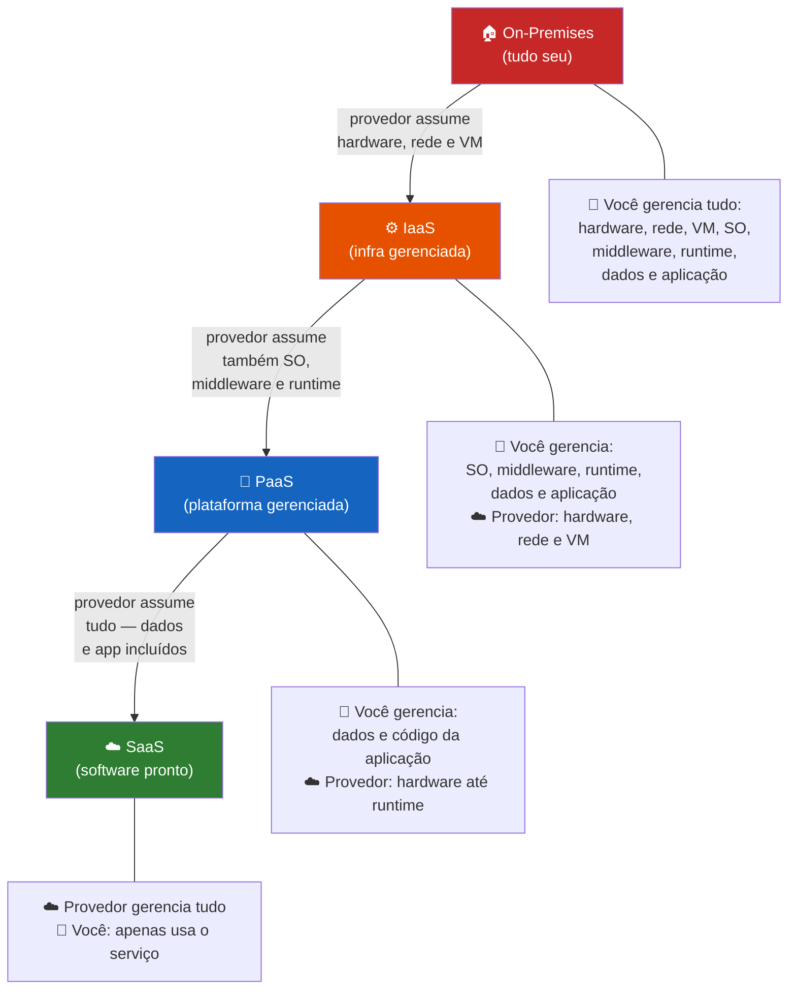

# 06 — Fundamentos de Cloud Computing

← [Módulo 05](05-sistemas-operacionais.md) | **Módulo 06** | [Módulo 07 →](07-inteligencia-artificial.md)

> 📎 **Materiais relacionados:** [Slides](../slides/06-cloud-computing.md) · [Checkpoint 03](../praticas/checkpoints/checkpoint-03.md)

---

## Objetivos de aprendizagem

Ao final deste módulo o estudante será capaz de:

- Definir computação em nuvem segundo o NIST e explicar suas cinco características essenciais.
- Diferenciar os modelos de serviço (IaaS, PaaS, SaaS) com exemplos concretos.
- Comparar nuvem pública, privada, híbrida e multicloud.
- Aplicar o modelo de responsabilidade compartilhada.
- Analisar aspectos de custo, escalabilidade, disponibilidade e segurança.

---

## 1. Definição Formal de Cloud Computing

O National Institute of Standards and Technology (NIST) define cloud computing de forma canônica (Mell & Grance, 2011):

> *"Cloud computing é um modelo que permite acesso ubíquo, conveniente e sob demanda a um pool compartilhado de recursos computacionais configuráveis (redes, servidores, armazenamento, aplicações e serviços) que podem ser rapidamente provisionados e liberados com esforço mínimo de gerenciamento ou interação com o provedor de serviço."*

### 1.1 Cinco Características Essenciais (NIST)

| Característica | Significado | Exemplo concreto |
|---------------|-----------|-----------------|
| **Self-service sob demanda** | Usuário provisiona recursos sem interação humana com o provedor | Criar VM pelo console web da AWS em 2 minutos |
| **Amplo acesso via rede** | Acesso por rede (internet ou VPN) de qualquer dispositivo | Acessar painel de controle do celular, notebook ou tablet |
| **Pool de recursos** | Recursos físicos são compartilhados entre múltiplos clientes (multi-tenancy) | Várias empresas usando o mesmo datacenter com isolamento lógico |
| **Elasticidade rápida** | Recursos crescem ou diminuem automaticamente conforme demanda | Auto-scaling de servidores durante Black Friday |
| **Serviço mensurado** | Cobrança baseada no uso real (pay-as-you-go) | Pagar R$ 0,02 por hora de VM ativa; R$ 0 quando desligada |

### 1.2 Contexto Histórico

A ideia de "computação como utilidade" remonta a John McCarthy (1961), que previu que a computação seria vendida como eletricidade — por consumo. Mas a materialização prática veio com:

- **2006:** Amazon Web Services (AWS) lança EC2 — VMs sob demanda para qualquer empresa.
- **2008:** Google App Engine — PaaS para aplicações web.
- **2010:** Microsoft Azure se consolida como plataforma enterprise.
- **2010s-2020s:** Kubernetes (2014), serverless (AWS Lambda, 2014), edge computing.

Hoje o mercado global de cloud computing ultrapassa US$ 500 bilhões/ano (Gartner, 2024), e 94% das empresas utilizam alguma forma de serviço cloud (Flexera, 2024).

---

## 2. Modelos de Serviço

### 2.1 A Pizza como Metáfora (e por que ela funciona)

| Cenário | Analogia | Modelo cloud |
|---------|---------|-------------|
| Fazer pizza em casa | Compra ingredientes, amassa, assa, serve | **On-premises** (infraestrutura própria) |
| Comprar pizza congelada | Alguém fez a massa e o molho; você assa e serve | **IaaS** |
| Pedir delivery | Pizza pronta, você só escolhe e serve | **PaaS** |
| Comer no restaurante | Tudo feito, você só consume | **SaaS** |



> ☁️ = gerenciado pelo provedor · 👤 = responsabilidade do cliente

### 2.2 IaaS — Infrastructure as a Service

O provedor oferece **infraestrutura virtualizada**: servidores (VMs), armazenamento, redes. O cliente gerencia o SO, middleware, runtime e aplicações.

**Exemplos:** Amazon EC2, Azure Virtual Machines, Google Compute Engine, DigitalOcean Droplets.

**Caso de uso:** empresa que precisa de servidores com configuração específica (compliance, SO customizado), mas não quer investir em datacenter próprio.

**Responsabilidade do cliente:** patching de SO, firewall, backup, segurança de dados.

### 2.3 PaaS — Platform as a Service

O provedor oferece a **plataforma de execução** completa: SO, runtime, banco de dados gerenciado. O cliente foca apenas no código da aplicação.

**Exemplos:** Heroku, Google App Engine, Azure App Service, AWS Elastic Beanstalk, Vercel, Railway.

**Caso de uso:** startup que quer publicar uma aplicação web rapidamente sem gerenciar servidores.

**Responsabilidade do cliente:** código, dados e configuração da aplicação.

### 2.4 SaaS — Software as a Service

O provedor oferece o **software pronto** para uso via navegador ou API. O cliente é consumidor final.

**Exemplos:** Google Workspace, Microsoft 365, Salesforce, Slack, Zoom, GitHub.

**Caso de uso:** qualquer organização que precisa de ferramentas de produtividade sem instalação local.

**Responsabilidade do cliente:** dados inseridos e configuração do workspace.

### 2.5 Outros Modelos Emergentes

| Modelo | Significado | Exemplo |
|--------|-----------|---------|
| **FaaS** (Function as a Service) | Executa apenas funções individuais, sem gerenciar servidor | AWS Lambda, Azure Functions, Google Cloud Functions |
| **CaaS** (Container as a Service) | Orquestra containers gerenciados | AWS ECS/EKS, Google GKE, Azure AKS |
| **DBaaS** (Database as a Service) | Banco de dados gerenciado | AWS RDS, Azure SQL, MongoDB Atlas, Supabase |

O paradigma **serverless** (FaaS) é particularmente disruptivo: o desenvolvedor escreve uma função, e o provedor gerencia toda a infraestrutura. Cobrança por milissegundo de execução. Sem servidor ocioso, sem custo ocioso.

---

## 3. Modelos de Implantação

| Modelo | Infraestrutura | Acesso | Cenário típico |
|--------|---------------|--------|---------------|
| **Nuvem pública** | Do provedor, compartilhada | Via internet | Startups, MVPs, apps genéricos |
| **Nuvem privada** | Própria ou exclusiva | Rede interna ou VPN | Bancos, governo, dados sensíveis |
| **Nuvem híbrida** | Combinação de pública + privada | Interconectadas | Empresa com dados sensíveis + workloads elásticos |
| **Multicloud** | Múltiplos provedores públicos | Via internet | Redução de vendor lock-in, otimização de custo |

### 3.1 Trade-offs

| Critério | Nuvem pública | Nuvem privada |
|----------|-------------|---------------|
| Custo inicial | Baixo (pay-as-you-go) | Alto (datacenter, equipe) |
| Escala | Praticamente ilimitada | Limitada ao hardware disponível |
| Controle | Menor | Total |
| Compliance | Depende do provedor | Configurável pela organização |
| Latência | Variável | Previsível (rede local) |

---

## 4. Modelo de Responsabilidade Compartilhada

Este é o conceito mais crítico de segurança em cloud — e o mais subestimado por iniciantes.

```
                 On-Prem     IaaS      PaaS      SaaS
                ┌────────┬─────────┬─────────┬─────────┐
 Dados          │ Cliente│ Cliente │ Cliente │ Cliente │
 Identidade/    │ Cliente│ Cliente │ Cliente │ Cliente │
 Acesso         │        │         │         │         │
 Aplicação      │ Cliente│ Cliente │ Cliente │Provedor │
 Middleware     │ Cliente│ Cliente │Provedor │Provedor │
 SO/Runtime     │ Cliente│ Cliente │Provedor │Provedor │
 Virtualização  │ Cliente│Provedor │Provedor │Provedor │
 Servidores     │ Cliente│Provedor │Provedor │Provedor │
 Storage        │ Cliente│Provedor │Provedor │Provedor │
 Rede física    │ Cliente│Provedor │Provedor │Provedor │
                └────────┴─────────┴─────────┴─────────┘
                    ■ Cliente    ■ Provedor
```

**Regra de ouro:** o provedor protege **a infraestrutura da nuvem**; o cliente protege **o que coloca dentro da nuvem** — identidade, dados, configuração de acesso.

Incidentes famosos de segurança em cloud (Capital One 2019, Twitch 2021) não foram falhas do provedor — foram **configurações erradas** do cliente (OWASP, 2021). Bucket S3 público com dados sensíveis é o equivalente digital de deixar a porta de casa aberta e culpar a construtora.

---

## 5. Aspectos de Custo

### 5.1 Modelos de Precificação

| Modelo | Como funciona | Melhor para |
|--------|--------------|------------|
| **Pay-as-you-go** | Paga pelo uso real (hora, GB, requisição) | Workloads variáveis |
| **Reserved instances** | Compromisso de 1-3 anos com desconto | Workloads previsíveis |
| **Spot instances** | Capacidade ociosa com grande desconto, mas pode ser interrompida | Processamento tolerante a interrupção |

### 5.2 Armadilhas de Custo

| Armadilha | Descrição | Prevenção |
|-----------|----------|-----------|
| Recursos esquecidos | VM ligada 24/7 sem necessidade | Tags, alertas de billing, políticas de auto-shutdown |
| Transferência de dados (egress) | Download de dados da cloud é cobrado; upload geralmente é gratuito | Planejar arquitetura que minimize egress |
| Over-provisioning | Alocar mais recurso do que precisa "por garantia" | Right-sizing, monitoramento contínuo |
| Vendor lock-in | Dependência de serviços proprietários que tornam migração cara | Usar padrões abertos (containers, K8s), avaliar portabilidade |

### 5.3 FinOps

FinOps (Financial Operations) é a disciplina que une engenharia, finanças e negócio para otimizar custos de cloud. Princípios da FinOps Foundation (2023):

1. Equipes devem ter **visibilidade** do consumo.
2. Decisões sobre custo devem ser **orientadas por dados**.
3. Um modelo centralizado de **responsabilidade** distribui ownership.

---

## 6. Disponibilidade e Tolerância a Falhas

### 6.1 SLA (Service Level Agreement)

| Nível | Disponibilidade | Downtime permitido/ano |
|-------|----------------|----------------------|
| 99% | "Dois noves" | ~3,65 dias |
| 99.9% | "Três noves" | ~8,76 horas |
| 99.99% | "Quatro noves" | ~52,56 minutos |
| 99.999% | "Cinco noves" | ~5,26 minutos |

Para alcançar alta disponibilidade, utilizam-se:

- **Regiões e zonas de disponibilidade:** datacenters fisicamente separados.
- **Load balancing:** distribui tráfego entre múltiplas instâncias.
- **Auto-scaling:** adiciona/remove instâncias automaticamente.
- **Backup e disaster recovery:** cópias em regiões geográficas distintas.

### 6.2 O Triângulo CAP (Brewer, 2000)

Em sistemas distribuídos, é impossível garantir simultaneamente:

- **Consistency (C):** todos os nós veem os mesmos dados ao mesmo tempo.
- **Availability (A):** toda requisição recebe resposta (mesmo que não seja a mais recente).
- **Partition tolerance (P):** o sistema continua operando mesmo com falha de rede entre nós.

O Teorema CAP afirma que, durante uma partição de rede, é preciso escolher entre C e A. Na prática, sistemas cloud fazem trade-offs explícitos conforme o caso de uso.

---

## 7. Atividade Prática — Progressão em 3 Níveis

### Nível 1 — Classificação (10 min)

Classifique cada serviço como IaaS, PaaS, SaaS, FaaS ou DBaaS:

| Serviço | Classificação |
|---------|-------------|
| Gmail | |
| Amazon EC2 | |
| Heroku | |
| AWS Lambda | |
| MongoDB Atlas | |
| Notion | |
| DigitalOcean Droplet | |
| Vercel | |

### Nível 2 — Arquitetura inicial (20 min)

Cenário: uma startup de delivery de comida local que hoje roda em um computador na recepção precisa migrar para a nuvem.

Proponha:

1. Modelo de serviço principal e justificativa.
2. Modelo de implantação (pública, privada, híbrida) e justificativa.
3. Diagrama simples da arquitetura proposta.
4. Estimativa simplificada de custo mensal (pesquise preços de free tier).
5. Estratégia de backup e frequência.
6. Controle de acesso: quem pode acessar o quê.

### Nível 3 — Análise crítica (20 min)

1. Pesquise um caso real de incidente de segurança em cloud (Capital One 2019 ou similar). Descreva: o que aconteceu, a causa raiz e o que deveria ter sido feito.
2. Explique o conceito de vendor lock-in usando um exemplo concreto (ex: trocar de AWS para Azure com banco proprietário DynamoDB).
3. Uma empresa quer 99.99% de disponibilidade. Calcule o downtime máximo por mês e proponha 3 mecanismos técnicos para atingir esse SLA.

---

## 8. Síntese

Cloud computing não é modismo — é a infraestrutura padrão do desenvolvimento de software moderno. Entender seus modelos, responsabilidades e armadilhas é competência essencial para ADS. Profissional que sabe apenas "subir na AWS" sem entender custo, segurança e arquitetura vai gerar mais problema do que solução. A nuvem resolve muitos problemas de infraestrutura, mas cria novos desafios de governança, custo e complexidade que exigem formação sólida.

---

## Referências

- BREWER, Eric A. Towards robust distributed systems. *Proceedings of the 19th Annual ACM Symposium on Principles of Distributed Computing (PODC)*, 2000. Disponível em: <https://doi.org/10.1145/343477.343502>
- FINOPS FOUNDATION. *FinOps Framework*. 2023. Disponível em: <https://www.finops.org/framework/>
- FLEXERA. *2024 State of the Cloud Report*. Disponível em: <https://www.flexera.com/blog/cloud/cloud-computing-trends/>
- GARTNER. *Forecast: Public Cloud Services, Worldwide*. 2024.
- MARINESCU, Dan C. *Cloud Computing: Theory and Practice*. 3. ed. Morgan Kaufmann, 2022.
- MCCARTHY, John. Remarks at the MIT Centennial. 1961.
- MELL, Peter; GRANCE, Timothy. *The NIST Definition of Cloud Computing* (SP 800-145). NIST, 2011. Disponível em: <https://doi.org/10.6028/NIST.SP.800-145>
- OWASP. *OWASP Cloud Security Top 10*. 2021. Disponível em: <https://owasp.org/www-project-cloud-security/>
- VELTE, Anthony T.; VELTE, Toby J.; ELSENPETER, Robert. *Cloud Computing: A Practical Approach*. McGraw-Hill, 2010.
- AWS. *Shared Responsibility Model*. Disponível em: <https://aws.amazon.com/compliance/shared-responsibility-model/>
- MANOEL, Sérgio da Silva. *Computação em Nuvem*. Brasport, 2015.

---

← [Módulo 05](05-sistemas-operacionais.md) | **Módulo 06** | [Módulo 07 →](07-inteligencia-artificial.md)
