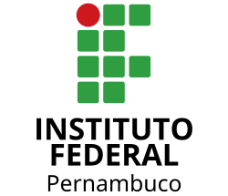

<!-- _class: capa -->
<!-- _paginate: false -->
<!-- _header: '' -->
<!-- _footer: '' -->



# Introdução à Computação

## Módulo 01 · Pensamento Computacional

**Prof. Hélio Bentzen**
IFPE · Análise e Desenvolvimento de Sistemas

---

# 🧠 Pensamento Computacional

---

## O que é Computação?

> Ciência do **pensamento estruturado** aplicado à resolução de problemas — Aho & Ullman, 1992

- Não é "mexer no computador"
- Estuda **algoritmos** e suas propriedades
- Impacta **todas** as áreas do conhecimento


---

## Os 4 Pilares — Wing (2006)

| Pilar | O que faz |
|-------|----------|
| 🧩 **Decomposição** | Divide o problema em partes menores |
| 🔍 **Padrões** | Identifica regularidades |
| 🎭 **Abstração** | Foca no essencial, ignora ruído |
| 📋 **Algoritmos** | Define passos para a solução |

> Se o problema parece impossível, *você não dividiu o suficiente*.

---

## Pilar 1 — Decomposição

Quebrar um problema grande em **subproblemas gerenciáveis**.

| Problema | Subproblemas |
|----------|-------------|
| App de delivery | Cadastro · Cardápio · Carrinho · Pagamento |
| Planejar viagem | Destino · Transporte · Hotel · Roteiro |

---

## Pilar 2 — Reconhecimento de Padrões

Encontrar **regularidades** entre problemas ou dados.

- 🎵 Spotify — padrões no histórico → playlist
- 🏦 Banco — padrões de transações → fraude
- 🏥 Medicina — padrões de sintomas → diagnóstico

> Sem padrões → cada problema resolvido do zero.

---

## Pilar 3 — Abstração

Focar no **essencial**, descartar o irrelevante.

| Realidade complexa | Abstração útil |
|-------------------|---------------|
| Mapa com relevo e rios | Mapa do metrô: estações + linhas |
| Pessoa com 200+ atributos | Cadastro: nome, CPF, e-mail |

*Boa abstração remove complexidade* **sem perder informação essencial**.

---

## Pilar 4 — Algoritmos

Sequência **finita, ordenada e não-ambígua** de passos.

✅ **Finitude** — termina em tempo finito
✅ **Definitude** — cada passo é preciso
✅ **Entrada/Saída** — recebe dados, produz resultado
✅ **Efetividade** — cada passo é realizável

---

## Existe Limite? — Problema da Parada

**Turing (1936):** é impossível criar um programa que determine, para *qualquer* programa, se ele vai parar ou rodar para sempre.

```
           ┌──────────────┐
  P(x) ──▶│  Vai parar?   │──▶ ??? (indecidível)
           └──────────────┘
```

> Existem problemas que **nenhum algoritmo** pode resolver.

---

## Na Prática — ADS

| Pilar | Aplicação profissional |
|:-----:|----------------------|
| 🧩 | Quebrar requisitos em *user stories* |
| 🔍 | Reutilizar *design patterns* |
| 🎭 | Modelar APIs e interfaces |
| 📋 | Implementar lógica de negócio |

---

## Referências

- Wing, J. (2006). *Computational Thinking.* CACM
- Aho & Ullman (1992). *Foundations of Computer Science*
- Turing, A. (1936). *On Computable Numbers*

**→ Checkpoint 01** · com módulo 02
